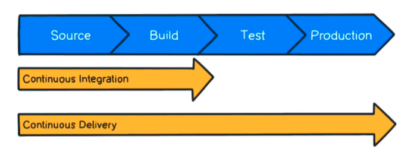

<!-- omit from toc -->
# CICD - Continuous Integration Continuous Delivery

CICD is a practice (business culture / business practice) on how the source code is managed / handled. Moreover, it defines how this code makes its way into production.

<!-- omit from toc -->
## Content

- [Infrastructure as Code](#infrastructure-as-code)
- [The CICD Pipeline](#the-cicd-pipeline)
- [CI - Continuous Integration](#ci---continuous-integration)
- [CD - Continuous Delivery](#cd---continuous-delivery)
  - [Benefits](#benefits)
- [Popular CICD Tools](#popular-cicd-tools)
- [References](#references)

## Infrastructure as Code

The idea behind infrastructure as code is the idea behind DevOps. We're talking about integrating our development efforts and our operations efforts into one cohesive environment.

With infrastructure as code, we now have one base level of production.

Deploying infrastructure from code is like deploying infrastructure from documentation.

When multiple environments are spun up, we can ensure they are on the same version and same code. Moreover, as things are changed they have to be checked back in, approved, and tested in that code.

Infrastructure as code isn't just talking about deploying infrastructure from code. We're actually talking about a business process. We're talking about a business culture.

What we're outlining here is the [The CICD Pipeline](#the-cicd-pipeline).

## The CICD Pipeline

## CI - Continuous Integration

A development practice of code integration into a shared repository (ex: GitHub, GitLab).

A number of different developers and code types/languages may be contributing to the same shared repository.

Each integration is verified by an automated build and automated tests.

- Develop and compile.
- Perform unit tests.
  - Ensures that each line of code written works to expectation.
  - Typically all the unit tests are run in the developer’s work branch before merging code into a common code-base. If the unit tests to pass in the automated process, the developers code is not merged. The developer will be notified if this happens to be the case.
- Integrate with Database.
- Perform production deployment.
  - Ex: moving code to various types of computing environments such as ‘testing’ and ‘staging.’
- Perform functional tests and code labeling.
- Generate reports and analyze code.

## CD - Continuous Delivery

An extension of continuous integration that aims to reduce the time the development team takes between writing one new line of code and using it in production.

- Continuous delivery is a highly automated process.
  - Reduces the need for human interaction in the deployment process.
- Scripts take over manual work during deployment.
- Scripts create the computing environment before deployment.
- Automation increases accuracy.

### Benefits

- Faster feedback from end users on each new feature as it is released to production.
- Faster return on investment for each feature as it gets developed.

In the networking environment when it comes to this task (Build & Test) we may use a tool like VIRL or CML to simulate the environment coupled with something like PYATS to run simulated tests against the environment.

## Popular CICD Tools

- Jenkins
- Travis CI
- Bamboo
- TC
- GitLab

## References

- <https://youtu.be/Lfi9lDx6qtM>
